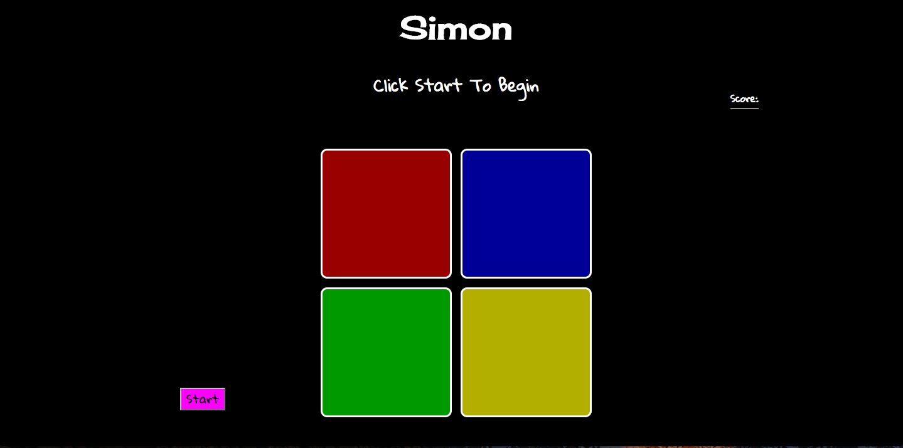

# Simon

## Technologies used

HTML, CSS, JavaScript, JQuery

## Project MVP

Player clicks start to start game. Player is shown a sequence of colored blinks. One additional color is added for each round. A point is added for each sequence repeated successfully. 

## Can't get this to work

Can't get the game to accurately display a sequence that repeats a color more than once. Game is not correctly storing built up sequence. 

